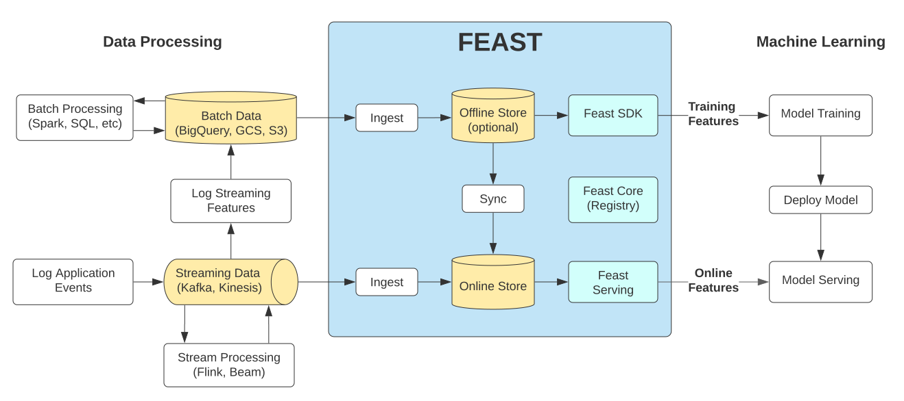

# Introduction

### What is Feast?

Feast \(**Fea**ture **St**ore\) is an operational data system for managing and serving machine learning features to models in production.

### What problems does Feast solve?

**Models need consistent access to data:** ML systems built on traditional data infrastructure are often coupled to databases, object stores, streams, and files. This coupling makes changes in data infrastructure difficult without breaking dependent ML system. To make matters worse, dual implementations of data retrieval for training and serving can lead to inconsistencies in data which in turn causes training-serving skew.

Feast decouples your models from your data infrastructure by providing a single data access layer that abstracts feature retrieval from feature storage. Feast also provides a consistent means of referencing feature data for retrieval, ensuring that models remain portable when moving from training to serving.

**It's hard to get new features into production:** Many ML teams consist out of members with different responsibilities and incentives. Data scientists aim to get features into production as soon as possible, while engineers want to ensure that production systems remain stable, creating an organizational friction that slows time-to-market for new features.

Feast provides a centralized data system to which data scientists can publish features, and a battle-hardened serving layer, making it possible for non-engineering teams to ship features into production with minimal oversight.

**Models need point-in-time correct data:** ML models need a consistent view of data in production than what they were trained on. A challenge that many teams face is preventing the leakage of feature data to models during training. Feast solves data leakage by providing point-in-time correct feature retrieval when exporting feature datasets for model training.

**Feature aren't being reused across projects:** The lack of reuse of features across teams is a cost that many organizations currently bear, and is often driven by the siloed nature of development coupled with the monolithic design of end-to-end ML systems.

Feast tries to address the lack of feature reuse by providing a centralized system to which teams can both contribute and consume features. Data scientists start new ML projects by selecting features from a centralized registry, instead of having to develop new features from scratch.

### What problems does Feast not yet solve?

**Feature engineering:** Feast intends to eventually support light-weight feature engineering as part of its API, but this is not implemented yet. Our current focus is primarily on operational \(ingestion, serving, monitoring\) functionality.

**Feature discovery:** Feast enabled reuse of features through its central registry. However, it still lacks a user interface which would make the exploration and discovery of entities and features a first-class functionality.

**Feature validation:** Feast has very limited support for statistic generation of feature data and validation of this data. We consider data validation a first class problem. We intend to leverage existing data validation tooling to address the operational data validation needs of ML teams.

### What is Feast not?

\*\*\*\*[**ETL**](https://en.wikipedia.org/wiki/Extract,_transform,_load) **or** [**ELT**](https://en.wikipedia.org/wiki/Extract,_load,_transform) **system:** Feast is not \(and does not plan to be\) a general purpose data transformation or pipelining system. Feast plans to eventually have a light-weight feature engineering toolkit, but we encourage teams to integrate Feast with upstream ETL/ELT systems that are specialized on transformation.

**Data warehouse:** Feast is not a replacement for your data warehouse or the source of truth for all transformed data in your organization. It is meant to be a light-weight downstream layer that can serve data from an existing data warehouse \(or other data sources\) to models in production.

**Data catalog:** Feast is not a general purpose data catalog for your organization. Feast is purely focused on cataloging features meant for use in ML pipelines or systems.

### How can I get started?


The best way to learn Feast is to use it. Head over to our [Quickstart](quickstart.md) and try out our examples!


 Explore the following resources to get started with Feast:

* [Getting Started](getting-started/) provides guides on [Installing Feast](getting-started/install-feast/) and [Connecting to Feast](getting-started/connect-to-feast/).
* [Concepts](./) describes all important Feast API concepts.
* [User guide](user-guide/data-ingestion.md) provides guidance on completing Feast workflows.
* [Examples](https://github.com/feast-dev/feast/tree/master/examples) contains Jupyter notebooks that you can run on your Feast deployment.
* [Advanced](advanced/troubleshooting.md) contains information about both advanced and operational aspects of Feast.
* [Reference](reference/api/) contains detailed API and design documents for advanced users.
* [Contributing](contributing/contributing.md) contains resources for anyone who wants to contribute to Feast.

