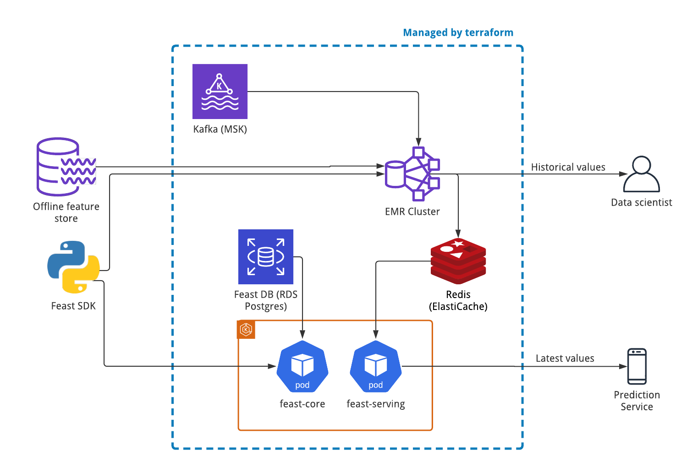

# Kubernetes \(Amazon EKS\) with Terraform

### Overview

This guide will give walk-through of installing Feast on AWS using our [reference Terraform config](https://github.com/feast-dev/feast/tree/master/infra/terraform/aws).


The Terraform config used here is a greenfield installation that doesn't assume anything about, and doesn't integrate with existing resources in your AWS account. It makes this an easy way to get started, but you will likely want to customize this setup before using Feast in production.


This Terraform config will create the following resoures:

* Kubernetes cluster on Amazon EKS \(3x r3.large nodes\)
* Kafka managed by Amazon MSK \(2x kafka.t3.small nodes\)
* Postgres database for Feast metadata, using serverless Aurora \(min capacity: 2\)
* Redis cluster, using Amazon Elasticache \(1x cache.t2.micro\)
* Amazon EMR cluster to run Spark \(3x spot m4.xlarge\)
* Staging S3 bucket to store temporary data



## 0. Requirements

* An AWS account and [credentials configured locally](https://docs.aws.amazon.com/cli/latest/userguide/cli-chap-configure.html)
* [Terraform](https://www.terraform.io/) &gt;= 0.12 \(tested with 0.13.3\)
* [Helm](https://helm.sh/docs/intro/install/) \(tested with v3.3.4\)

## 1. Configure Terraform 

Under`feast/infra/terraform/aws`create a `.tfvars` file. The name does not matter, let's call it `my_feast.tfvars`. You can see the full list of configuration variables in `variables.tf` . At very least we need to set `name_prefix` and AWS region:


```typescript
name_prefix = "my-feast"
region      = "us-east-1"
```


## 2. Apply

Once you're happy with the configuration you can init Terraform and apply

```bash
$ cd feast/infra/terraform/aws
$ terraform init
$ terraform apply -var-file=my_feast.tfvars
```

This might take a while but in the end everything should succeed. You'll also see a kubectl config file created in this directory. Its name will start with `kubeconfig_` and end with a random suffix.

## 3. Connect to Feast using Jupyter

Once the pods are all running we can connect to the Jupyter notebook server running in the cluster.

To be able to connect to the remote Feast server we just set up, you need to forward a port from remote Kubernetes cluster to your local machine. Replace `kubeconfig_XXXXXXX` below with the file name of the kubeconfig generated for you by Terraform.

```bash
KUBECONFIG=kubeconfig_XXXXXXX kubectl port-forward \
$(kubectl get pod -o custom-columns=:metadata.name | grep jupyter) 8888:8888
```

```text
Forwarding from 127.0.0.1:8888 -> 8888
Forwarding from [::1]:8888 -> 8888
```

You should be able to connect at `localhost:8888` to the bundled Jupyter Notebook Server with example notebooks.

